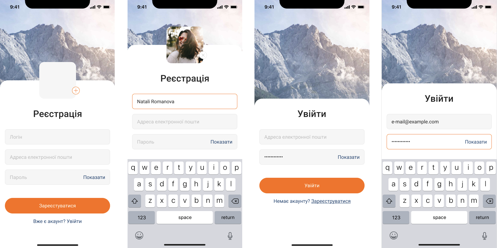

# Mobile Application "Social Network"

## 

<b>Developed for:</b> iOS, Android

<b>Design Layout:</b> <a href="https://www.figma.com/file/YqWLNarVE4x1zkXa6PYJfi/Homework-(Copy)-(Copy)?type=design&node-id=3-26">Figma</a>

<b>Technologies:</b> JavaScript, React, ReactNative

<b>Software:</b> VSCode, Expo, Java Development Kit(jdk) 11, Android Studio, Xcode

---

# Functionality

Log-in and Registration screens. Controlled inputs. Focused and unfocused inputs. Submitting form. Browsing between screens. Using localstate for saving data from inputs. Styled components.

---

# Screens

 

---

# How to try

1. Install VSCode

2. For Android simulation install <b>Java Development Kit(jdk) 11</b> and <b>Android Studio</b>

3. For Iphone simulation install <b>Xcode</b>

4. For testing on real devise install on phone <b>Expo Go</b>

5. Open the project on VSCode and enter in terminal <b>npx expo start</b>

6. For testing on real devise scan QR-code

7. For testing on Android simulator, enter in terminal <b>a</b>

8. For testing on Iphone simulator, enter in terminal <b>i</b>

---
